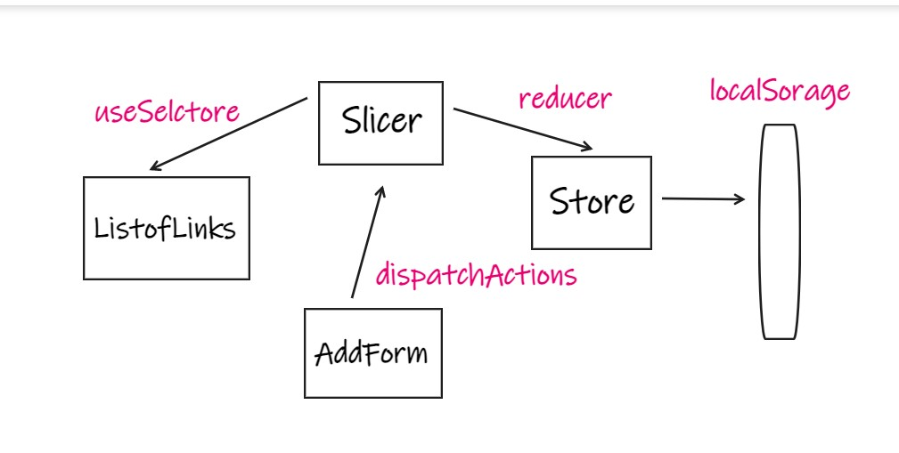
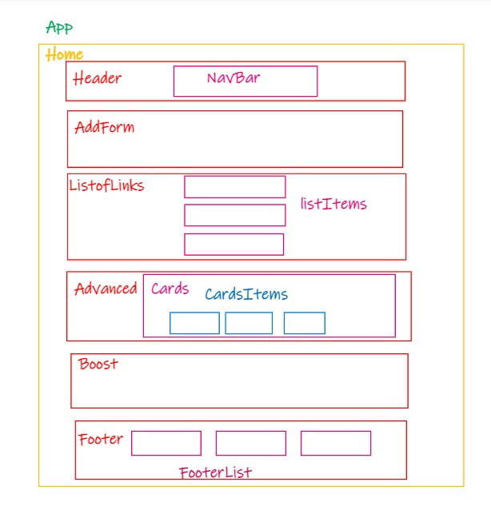

# Shorting

## Brief

URL shortening is a technique on the Web in which a Uniform Resource Locator (URL) may be made substantially shorter and still direct to the required page. This is achieved by using a redirect that links to the web page that has a long URL. For example, the URL "https://example.com/assets/category_B/subcategory_C/Foo/" can be shortened to "https://example.com/Foo", and the URL "http://example.com/about/index.html" can be shortened to "https://goo.gl/aO3Ssc ".

## Technologies

- React
- Redux toolkit
- Sass
- Bootstrap

## Dataflow

## Components Sturcture

